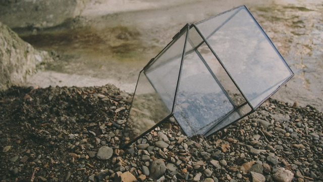
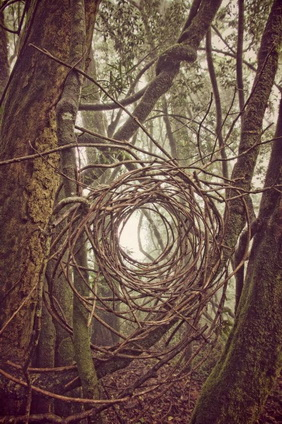
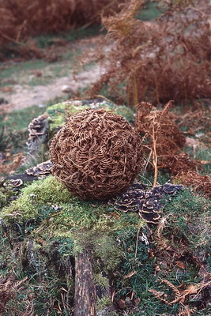

# JS image galereya filter

---
```
<div id='gallery'>
	<div id="grid">
		<div data-filter="Glass"></div>
		<div data-filter="Nature"></div>
		<div data-filter="Nature"></div>				
	</div>
</div>
```

```
<script>
	const gallery = new Gallery({selector:'#grid', duration:500});
	const gallery_filter = new Filter({selector:'#grid', column:4, duration:1000 });
	window.onload = function() {
		galleryInit();	
	}
</script>
```
